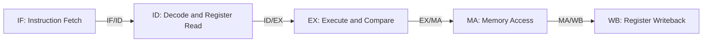

# Five-Stage RISC-V CPU in Verilog

This project implements an educational 32-bit, in-order RISC-V CPU in Verilog. Its five-stage pipeline makes instruction execution, control signals, register dependencies, and branch handling visible at the RTL level. The design provides a practical way to explore the datapath and pipelining concepts taught in UC Berkeley's CS61C.

The core includes a 32-register integer register file, an ALU, an immediate generator, a branch comparator, four sets of pipeline registers, and dedicated forwarding, stall, and flush logic. Instruction and data memory are connected through separate external interfaces.

## Pipeline Architecture

The source code uses **MA** for the memory-access stage, commonly called **MEM**.

| Stage | Responsibilities | Main source files |
| --- | --- | --- |
| **IF — Instruction Fetch** | Drive the instruction address from the PC. Normally advance by four bytes; hold the PC for a load-use stall or redirect it for a branch or jump. | `program_counter.v`, `if_id.v` |
| **ID — Instruction Decode** | Decode the instruction, read `rs1` and `rs2`, construct the immediate, and generate control signals. | `control_unit.v`, `regfile.v`, `imm_gen.v`, `id_ex.v` |
| **EX — Execute** | Select forwarded operands, perform arithmetic or logic, calculate memory addresses and branch/jump targets, and compare branch operands. | `alu.v`, `branch_comp.v`, `ex_ma.v` |
| **MA — Memory Access** | Access data memory, determine the branch/jump redirect, and select the ALU result, load data, or `PC + 4` for writeback. | `cpu.v`, `control_unit.v`, `ma_wb.v` |
| **WB — Writeback** | Write the registered result into the destination register when writeback is enabled. | `regfile.v`, `cpu.v` |

The modules are connected in [RTL/cpu.v](RTL/cpu.v). Pipeline registers carry instruction data and the control signals needed by later stages. The PC, pipeline registers, and register-file writes update on the rising clock edge. Reset is synchronous and active high; it clears the PC to address zero and clears the register file.

Branch comparison and target calculation occur in **EX**, while the redirect decision uses their registered values in **MA**. The writeback selection also occurs in MA, before the selected value enters the MA/WB register.

## Hazard Handling

- **Operand forwarding:** `forward_sel.v` detects dependencies on instructions in MA and WB. EX operands prioritize the MA ALU result, then the WB result, then the values captured from the register file. Forwarded operands also feed the branch comparator and store-data path.
- **Load-use stalls:** `load_stall_unit.v` detects a dependency on a load in EX. It holds the PC and IF/ID register and inserts a bubble into ID/EX, while older instructions continue. When the dependent instruction subsequently reaches EX, the load result is available through WB forwarding.
- **Control-hazard flushing:** On a taken branch or jump, `flush_unit.v` coordinates clearing IF/ID, ID/EX, and EX/MA to discard younger instructions. MA/WB continues normally so that the redirecting instruction can complete its writeback.
- **Register-file bypass:** `regfile.v` can return the current WB value directly on a matching read port. Register `x0` always reads as zero, and writes to it are ignored.

## Memory Organization

The CPU exposes `imem_addr` / `imem_rdata` for instruction fetch and `dmem_addr`, `dmem_wdata`, `dmem_we`, `dmem_funct3`, and `dmem_rdata` for data access. The core does not instantiate memory internally; a testbench or system wrapper must connect it.

Two simple memory models are provided in `RTL/`:

- `instruction_memory.v`: 1,024 entries of 32-bit instructions, indexed by `pc_if[11:2]`, with combinational reads.
- `data_memory.v`: 4 KiB of byte-addressed, little-endian storage, with combinational reads and rising-edge writes. It includes byte, halfword, and word accesses, plus signed and unsigned subword loads.

Neither model initializes its contents automatically. The memory interface has no ready/valid handshake or variable-latency support, so instruction and load data must be available within their respective pipeline stages.

## Connections to CS61C

The following mappings connect specific parts of this implementation to the course material:

| CS61C topic | Connection in this CPU |
| --- | --- |
| **Instruction formats and immediates** | `imm_gen.v` reconstructs I-, S-, B-, U-, and J-type immediates from instruction fields. This corresponds to the immediate-generation work in [Lab 6: CPU, Pipelining](https://cs61c.org/sp25/labs/lab06/). |
| **Datapath and control** | The PC, register file, ALU, comparator, and operand/writeback multiplexers implement the building blocks of the [CS61C datapath](https://notes.cs61c.org/content/datapath/). Signals such as `RegWEn`, `ImmSel`, `Asel`, `Bsel`, `ALU_sel`, `MemRW`, and `WBsel` select each instruction's path. |
| **Five-stage pipelining** | The four pipeline-register modules separate IF, ID, EX, MA, and WB. Most control signals are decoded in ID and carried forward with the instruction, matching an approach described in the [five-stage pipeline notes](https://notes.cs61c.org/content/pipeline/five-stage-pipeline/). |
| **Data hazards and forwarding** | MA-to-EX and WB-to-EX forwarding, register-file bypass, and the load-use bubble implement the mechanisms discussed in the [data-hazard notes](https://notes.cs61c.org/content/pipeline-hazards/data-hazards/). |
| **Control hazards** | Resolving redirects in MA leaves younger instructions in the pipeline. Flushing those instructions connects directly to the course discussion of [control hazards](https://notes.cs61c.org/content/pipeline-hazards/control-hazards/). |
| **Structural hazards** | Separate instruction and data ports allow instruction fetch and a load/store to proceed concurrently when backed by independent memories, illustrating the [structural-hazard discussion](https://notes.cs61c.org/content/pipeline-hazards/structural-hazards/). |

The closest architectural reference is the course's five-stage lecture datapath. For comparison, [Spring 2025 CS61CPU Project 3](https://cs61c.org/sp25/projects/proj3/) uses Logisim, and its [Part B pipeline](https://cs61c.org/sp25/projects/proj3/part-b/) has two stages. This repository explores the five-stage model in Verilog with explicit forwarding, stall, and flush circuits.

## Instruction Scope and Current Status

The decoder includes paths for integer arithmetic and logic, shifts, signed and unsigned comparisons, loads and stores, conditional branches, `LUI`, `AUIPC`, `JAL`, `JALR`, and `MUL`. This describes the current RTL coverage; full RV32I or RV32IM compliance has not been established.

Some implementation details remain relevant when extending or testing the design:

- Only `MUL` is explicitly decoded from the multiplication extension. High-product operations present inside the ALU do not establish instruction-level support, and division/remainder are not implemented.
- The current `JALR` path uses the ALU target directly; it still needs explicit clearing of target bit 0 to match the [RISC-V specification](https://docs.riscv.org/reference/isa/v20240411/unpriv/rv32.html).
- Load-use detection can insert unnecessary stalls because it does not exclude destination register `x0` or fully qualify every source-register field by instruction type.
- The design has no caches, virtual memory, or exception/interrupt machinery. The supplied memory models have no address-bound checks.

Simulation requires a separate testbench that supplies clock/reset, connects the memory interfaces, initializes a program, and checks architectural results. A testbench and regression results were not present in the source snapshot used to prepare this README. When building from this layout, select the design files under `RTL/` once to avoid duplicate module definitions from any copies in the repository root.
